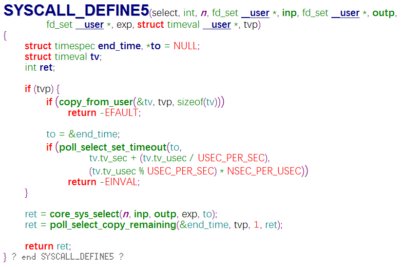
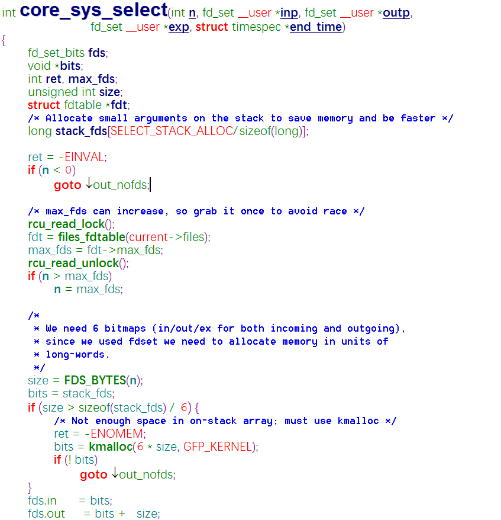
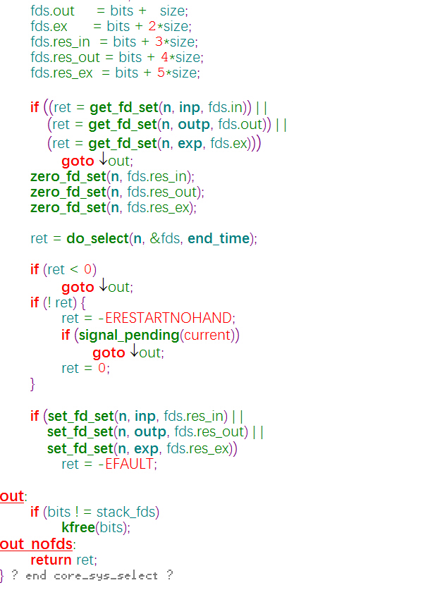
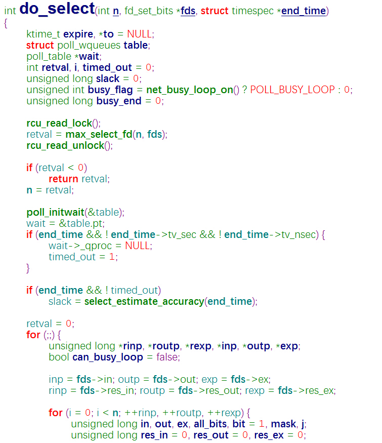
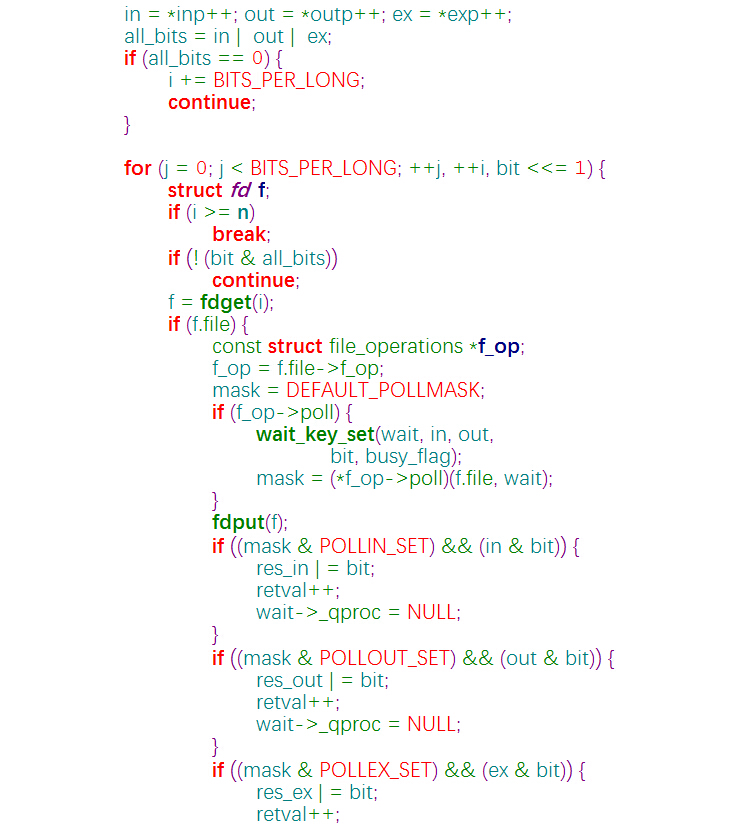
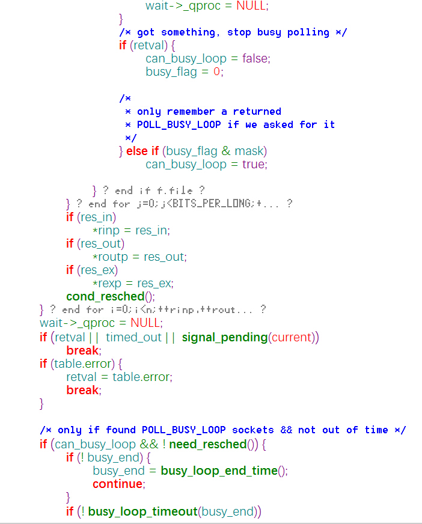
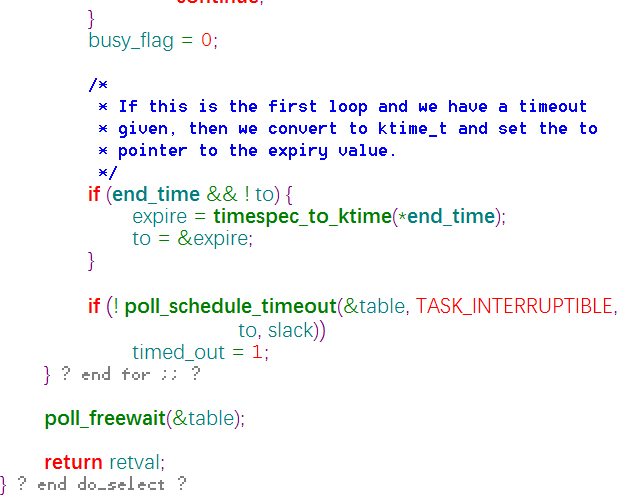

# IO-Multiplexing
从内核源码解读select、poll、epoll
## 一、 select内核实现
1. select系统调用入口

2. 参数：
 - n： 需要监听的文件描述符个数；
 - inp： 需要监听的输入文件描述符集合；
 - outp： 需要监听的输出文件描述符集合；
 - exp： 需要监听的异常文件描述符集合；
 - tvp： 用户态指定的等待时间长度，单位为秒和微秒，有以下三种情况：1.tvp == null，永远等待；2.tvp.tv_sec == 0 && tvp.tv_usec == 0，根本不等待，测试完所有指定的描述符并立即返回，这是轮询系统找到多个描述符而不阻塞select函数的方法；3.tvp.tv_sec != 0 || tvp.tv_usec != 0，等待指定的秒数和微秒数，当指定的描述符之一已准备好或当指定的时间值已经超过时立即返回
3. 详细实现流程：
 - 如果tvp != null，将用户空间的时间参数tvp通过copy_from_user传递到内核空间，timeval类型的时间结构体是从1970年1月1号开始的秒数以及微秒数，timespec是从1970年1月1号开始的秒数和纳秒数。poll_select_set_timeout修正时间。
 - 调用core_sys_select，该函数原型为：
 
 首先将文件描述符位图分配在栈上，这样可以节省内存空间而且会更快。SELECT_STACK_ALLOC = 256，所以stack_fds为大小32的long数组。也就是说如果需要监听的文件描述符的位图占有的字节数大于32 * 4 / 6必须在内存中分配位图，这里除6的原因是需要六组位图，分别保存输入/输出/异常的输入结果以及输出结果。初始化分配好的位图fds，其中输入描述符根据用户传入的参数初始化，结果描述符初始化为0。  
 调用do_select，该函数原型为：
 
 
 - 
4. 